## Capítulo 2
# Escalas Musicais

### Formação de escalas e acordes

Uma escala musical é um conjunto de notas musicais que possuem uma *hierarquia*. Esta hierarquia é automaticamente criada pelo fato das notas possuírem relacionamentos entre si, denotadas pelos intervalos musicais. A escala musical mais conhecida é a de C maior:

- C, D, E, F, G, A, B

No círculo de quintas, esse conjunto de notas formam uma vizinhaça:

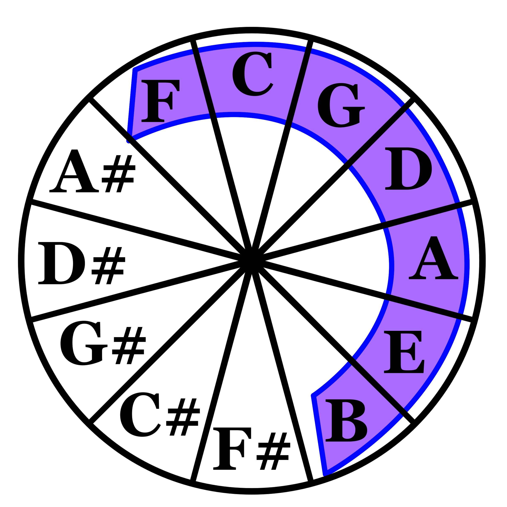

Este é um exemplo de *Escala Diatônica*.

Escala diatônica é toda escala que obedece a duas condições:

- Possui 7 notas
- As notas formam uma vizinhaça no círculo de quintas

Repare que apesar de ser a escala de C maior, o C em si está na segunda posição dessa sequência, que é uma posição que não parece ser muito especial. Não é nenhuma das extremidades enão é o centro da sequência. É como se não houvesse nada de intrínsecamente especial sobre o C nesse conjunto de notas e realmente não tem. 

A *hierarquia* surge apenas quando de fato usamos essas notas. O C pode ser a nota mais a esquerda no teclado, mas lembre-se que o teclado repete essas notas em diversas oitavas. Portanto o C não é obrigatoriamente a nota mais a esquerda quando colocamos em prática. A nota mais a esquerda pode muito bem ser o G e termos uma seleção específica de notas:

Isso é o que chamamos de *acorde*. Agora podemos fazer uma análise da hierarquia dessa seleção de notas. Para isto, basta descobrirmos quais intervalos as notas deste acorde formam em relação a nota mais a esquerda, no caso o G. Sugiro que você pare a leitura e faça essa análise por conta própria de acordo com os intervalos mostrados capítulo anterior.

Os intervalos presentes neste acorde são:

- Quarta justa - C
- Quinta perfeita - D
- Sétima menor - F
- Nona maior - A

Aqui escolhi chamar o A de Nona Maior pelo fato do A estar posicionado após a oitava do G. Isso é mais uma tradição do que uma regra absoluta. Além disso podemos reduzir os nomes desses intervalos e chamá-los apenas de:

- Quarta
- Quinta
- Sétima menor
- Nona

O intervalo de quinta é considerado o mais consonante (com exceção da própria oitava), e por isso muitas vezes ele é omitido da cifragem. Portanto, podemos dizer que este é um acorde de G com quarta, sétima menor e nona.

Também é válido fazer uma análise da hierarquia interna de um acorde. Por exemplo, podemos, momentaneamente, excluir o G e o C e olhar apenas para o D, o F e o A. Neste caso veremos que o F é a terça menor de D e o A é a quinta de D. 

A terça menor é um intervalo tradicionalmente muito importante para definições de acordes e escalas. Quando dizemos que um acorde é Maior, o que isso significa é que o acorde possui uma terça maior. Quando dizemos que o acorde é Menor, é porque ele possui uma terça menor. O mesmo vale para a escala. No começo do capítulo eu chamei esta escala de C maior, pois ela inclui um E que é a terça maior de C. Porém, se eu definisse a escala do ponto de vista do A, ela seria uma escala menor pois possui o C que é a terça menor de A.

Mas e se a escala possuir tanto a terça maior quanto a terça menor? Isso nunca acontece em escalas diatônicas. Sugiro que tente responder o porquê disso por conta própria.

A resposta é simples. Toda escala diatônica possui apenas 7 notas e elas formam uma vizinhaça no círculo de quintas. Você pode então tentar imaginar essa vizinhaça como uma minhoca girando ao redor do círculo, ou então como uma fila de 7 pessoas que estão todas de mãos dadas. Elas podem caminhar ao redor do círculo, mas não podem soltar as mãos. Agora suponha que seja possível existir uma escala diatônica onde uma nota possui tanto a terça menor quanto a terça maior. Suponha que esta notaé o C. A terça maior e a terça menor do C são, respectivamente, o E e o D#. Agora a fila de pessoas (ou a minhoca) precisam caminhar no círculo até cobrir tanto o E e o D#. Porém ao alcançar ambas essas notas, o C obrigatoriamente fica de fora. Para incluir tanto o C, como o E e o D#, uma das pessoas da fila teria que soltar a mão e se separar da fila (ou então a minhoca teria que ser cortada). Escalas assim são não-diatônicas e iremos também estudar várias escalas deste tipo em capítulos posteriores.

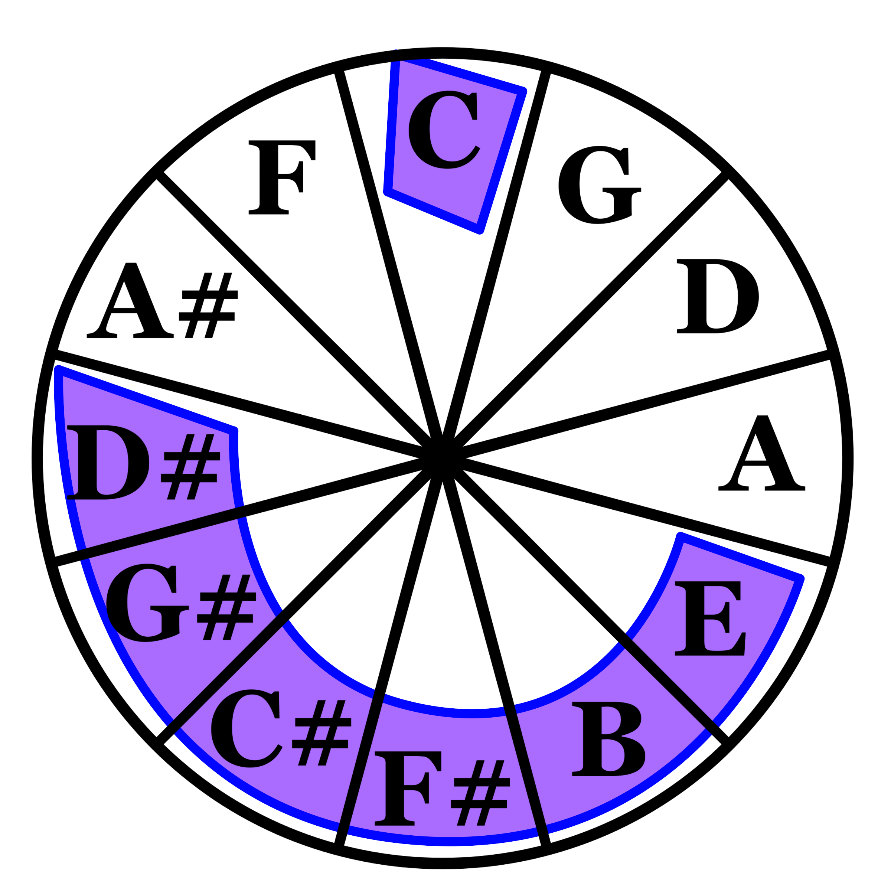
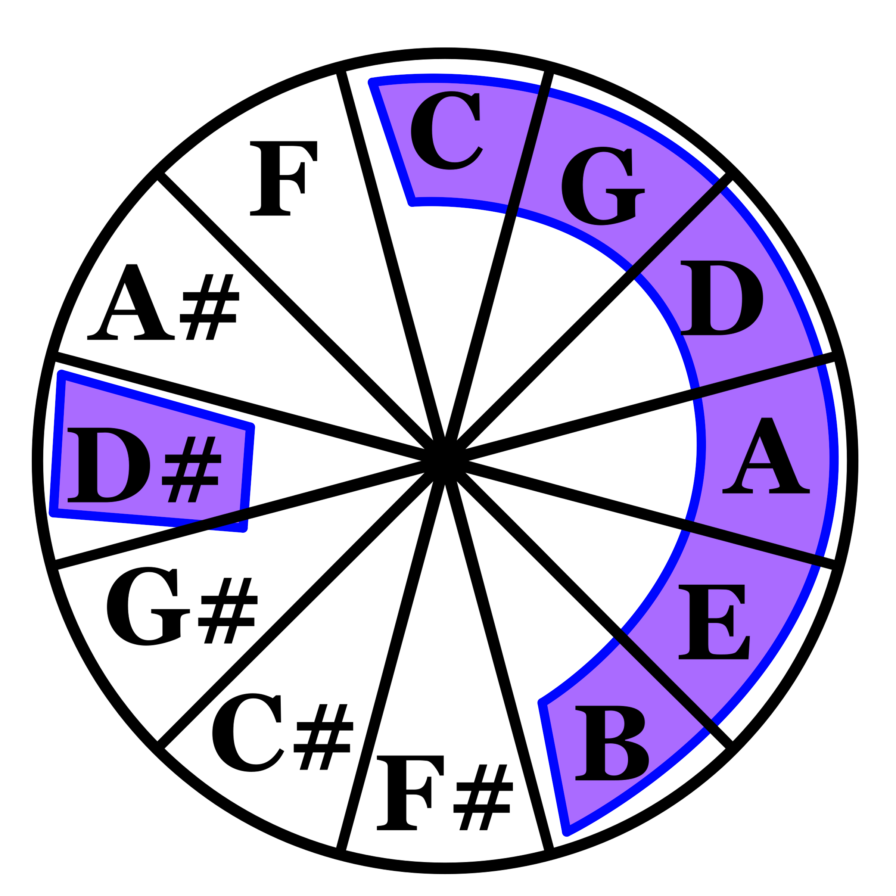

### Escalas diatônicas vizinhas

O círculo de quintas é a melhor ferramenta para se visualizar e obter escalas diatônicas e também escalas derivadas de escalas diatônicas. Assim como existe vizinhança entre as notas no círculo de quintas, também existe vizinhança entre as escalas que é ainda mais forte, poís elas compartilham muitas notas em comum. A seguinte escala é a de G maior e ela compartilha 6 notas em comum com o a escala de C maior apresentada no começo do capítulo:

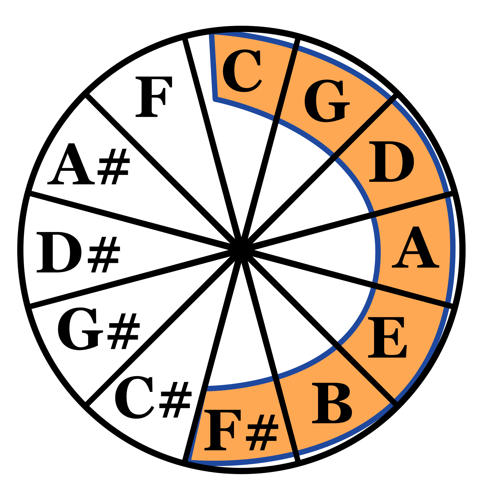

Portanto G maior é uma escala vizinha a C maior. Arnold Schoenberg (compositor muito importante do século XX) chama essas vizinhaças de ordinais de círculo de quinta ascendente/descendente. Por exemplo, o G maior é o *primeiro círculo de quinta ascendente* de C maior. D maior é o *segundo círculo de quinta ascendente* de C maior e assim por diante. Entretando, essa nomeclatura pode se tornar confusa. Chamarei de grau de vizinhança a distância entre duas escalas medida em passos sucessivos no círculo de quintas. Nesse caso, o G maior está no primeiro grau de vizinhança acima de C maior e o F maior está no primeiro grau de vizinhança abaixo de C maior.

A seguir alguns exemplos de escalas vizinhas acima de C maior:

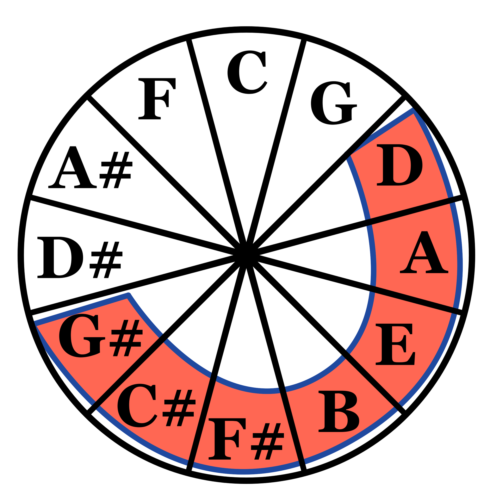

E também alguns exemplos de escalas vizinhas abaixo de C maior:

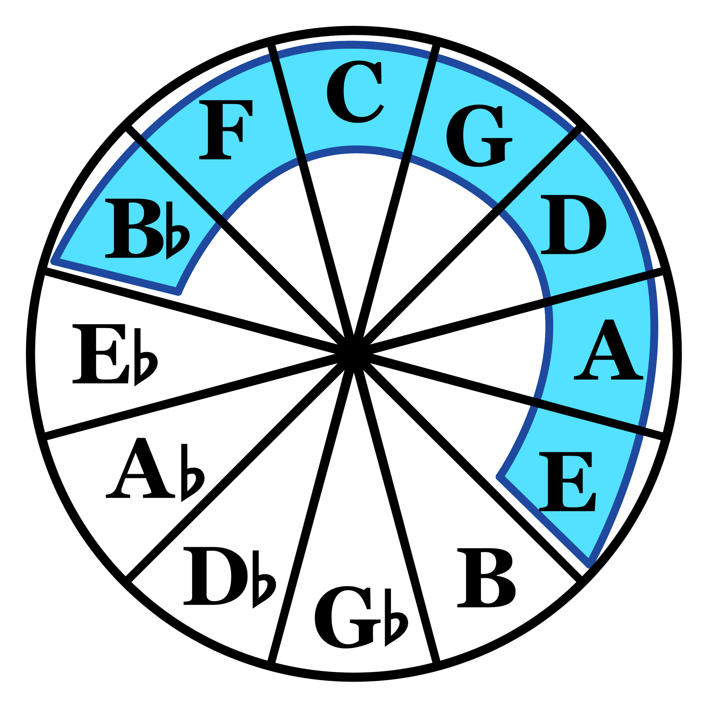
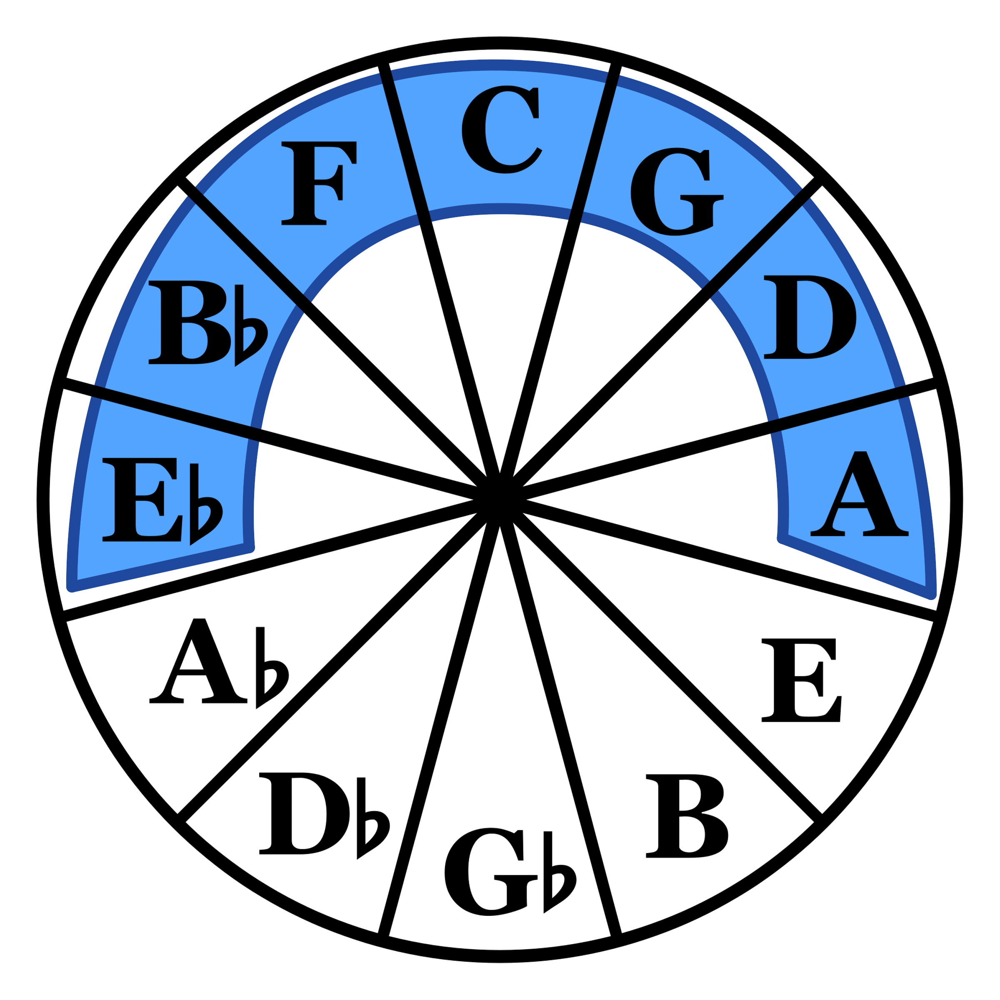

Repare que no caso das escalas vizinhas abaixo do C maior nós usamos o círculo de quintas contendo as notas com acidentes bemois ao invés das sustenidas. O principal motivo é para evitar repetição no nome das notas. Por exemplo na escala de F maior, se usássemos o círculo com acidentes sustenidos, teríamos ambos o A e o A#, mas como o B♭ representa a mesma nota que o A#, podemos fazer essa troca. Este conceito normalmente é confuso para a maioria dos alunos, mas acredito que o círculo de quintas ajuda a visualizar melhor a forma correta de escolher entre bemois e sustenidos.

Sugiro que pratique por conta própria a construção de escalas diatônicas. Fica como exercício a construção das seguintes escalas:

- A maior
- E maior
- B maior
- F# maior
- E♭ maior
- A♭ maior
- D♭ maior

Identifique também qual é o grau de vizinhança (e direção) de cada um deles em relação ao C maior.

### Escala Pentatônica

Escalas pentatônicas são subconjuntos de escalas diatônicas porém contendo apenas 5 notas. Essas 5 notas são vizinhas no círculo de quintas. Para obter uma escala pentatônica, basta remover as duas extremidades da escala diatônica (da forma que aparecem no círculo de quintas).

Exemplos:

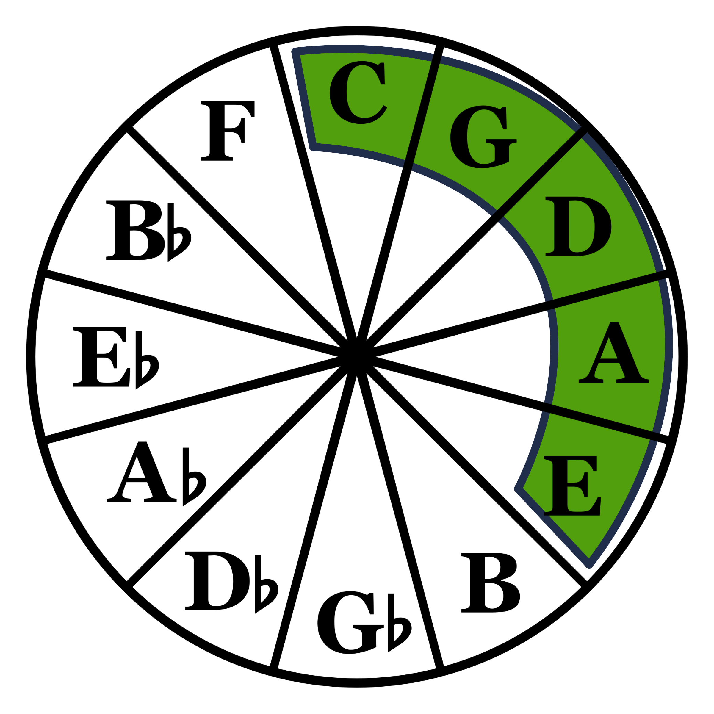
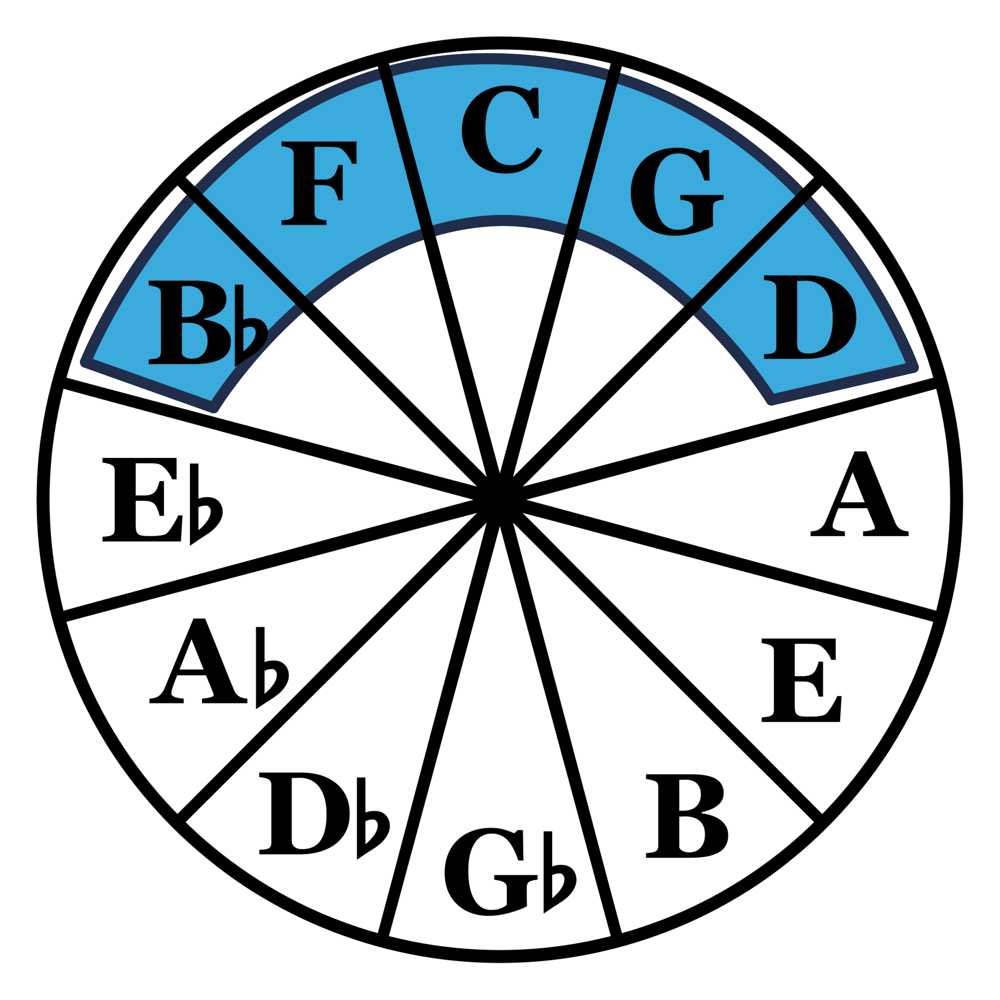

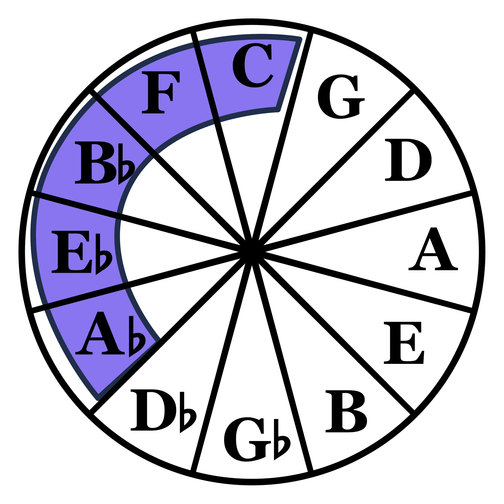
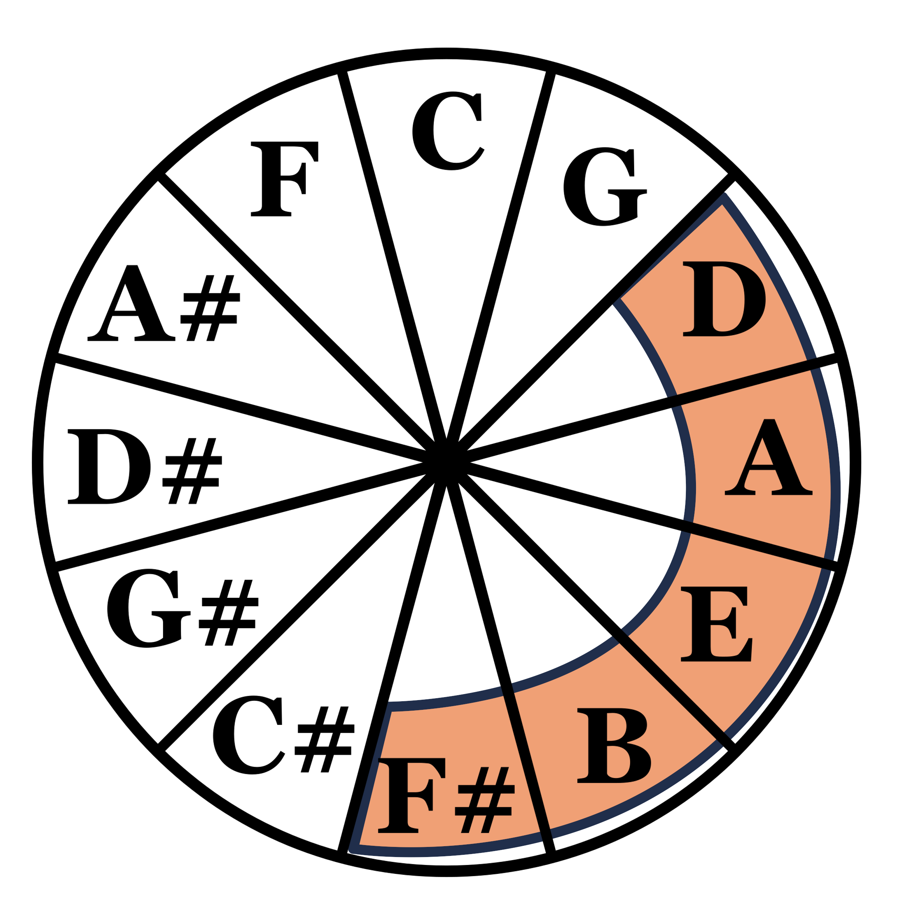

Respectivamente as escalas pentatônicas de C maior, B♭ maior, A♭ maior e D maior.

