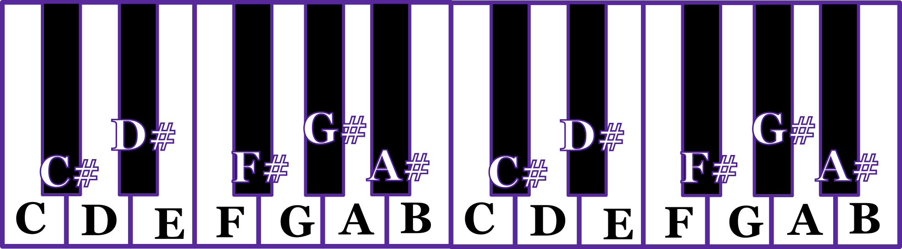
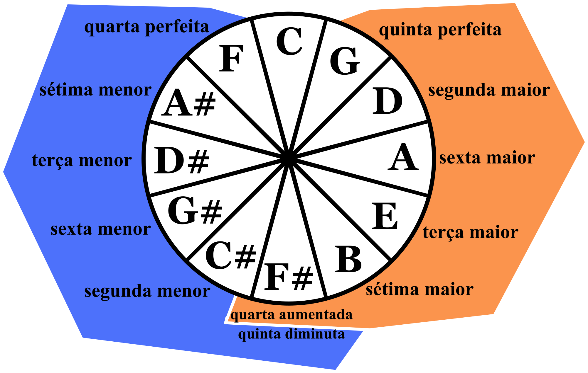
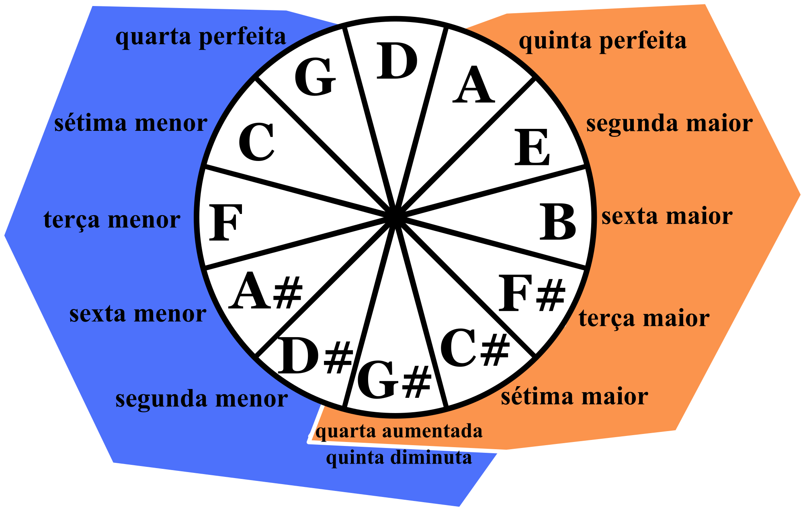
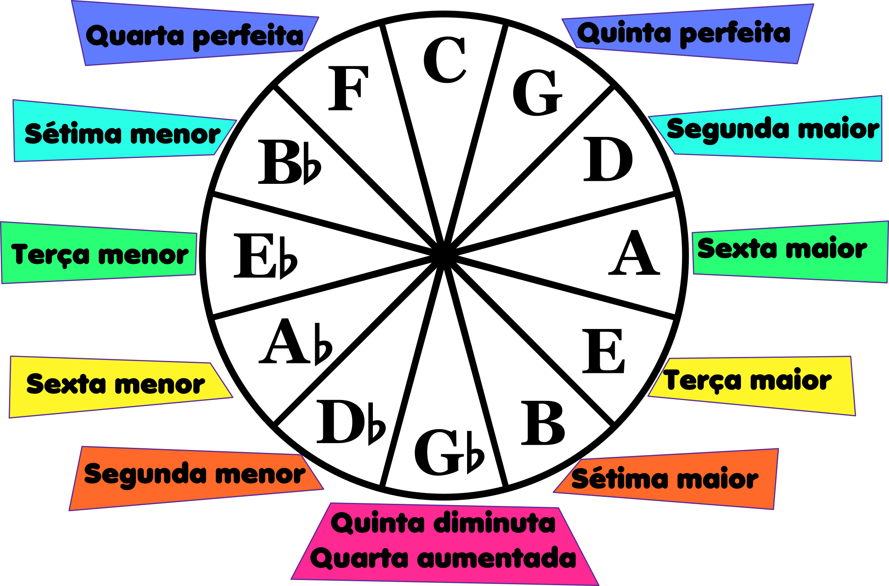
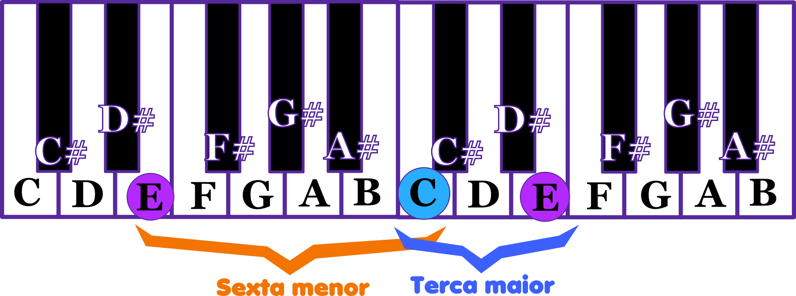

## Capítulo 1
# Notas e Intervalos Musicais

### As 12 notas musicais
Este é o círculo de quintas:

___

É a forma mais informativa de se olhar para as notas musicais. Na nossa infância nós aprendemos as notas musicais *Dó, Ré, Mi, Fá, Sol, Lá, Si* porém adotamos uma notação um pouco diferente ao se falar sobre música. Cada uma dessas notas recebe esse novo nome quando escrevemos sobre música ou escrevemos cifras:

- C é o Dó
- D é o Ré
- E é o Mi
- F é o Fá
- G é o Sol
- A é o Lá
- B é o Si

Em inglés, os músicos chamam as notas por essas letras, mas em português costumamos continuar chamando pelos nomes *Dó, Ré, Mi, etc*. Então quando, por exemplo, você vê *"Esta é uma cadência plagal de F maior para C maior"*, você poderá ler como *"Está é uma cadência plagal e fá maior para dó maior"*. É um pouco estranho no começo, mas logo nos acostumamos.

Repare que no círculo de quitnas, existem mais 5 notas musicais, são o A, D, G, C, F, porém com um símbolo "#" a direita. Este símbolo lê-se *sustenido* e significa que esta nota está um semitom acima. A imagem a seguir mostra como as notas estão distribuidas no teclado musical.

Há também o símbolo ♭ (bemol) para denotar que a nota está a um semitom abaixo:

Portanto o C# e o D♭ são a mesma nota. Ambas as notas bemois e sustenidas são chamadas de "acidentes". É um termo que não faz muito sentido semanticamente, porém ele continua sendo utilizado por tradição. Existe um motivo para usarmos ambas as nomeclaturas de sustenido e bemois. Isso ficará claro em capítulos posteriores.

> A distância entre o C e o D é a de um *tom* e a distância entre o C e o C# é a de um *semitom*. Sempre vamos usar esses termos ao decorrer do livro. Uma forma bem comum de se definir a formação de uma escala é utilizando esses termos na famosa ordem T-T-S-T-T-T-S que é basicamente uma instrução de como construir uma escala maior. Não utilizaremos isso nesse livro.

Reserve um tempo para reparar nas diferenças entre a organização das notas no teclado e a organização das notas no círculo de quintas. Perceba que existe uma ordenação diferente no círculo. As notas no teclado e em muitos isntrumentos como o violão, o violino, dentre outros, as notas são ordenadas de maneira crescente. É uma ordenação muito importante por causa da sonoridade das notas. Porém, a ordenação por quintas possui um outro tipo de importância. É uma ordenação por *consonância*. Notas mais próximas no círculo de quintas são mais consonantes entre si. Notas mais distantes são mais dissonantes entre si.

Esse jogo entre consonância e dissonância é um tema central no estudo da harmonia e vamos continuar falando sobre isso ao longo do livro inteiro, portanto não precisamos tentar definí-los agora. Por enquanto basta saber que o C e o G são bastante consonantes apesar de estarem distantes no teclado e que C e C# são bastante dissonantes apesar de estarem vizinhos no teclado. Isso significa que ao tocar as notas C e C# ao mesmo tempo, você irá sentir que essas notas não "combinam" (com certeza você terá sua própria forma de definir a sensação do confronto entre essas duas notas, você tem liberdade de tentar interpretar por conta própria o que essa sensação significa). 

### Os 12 intervalos musicais

Uma nota sozinha dificilmente terá um "sabor" por conta própria. A maioria das pessoas não possuem ouvido absoluto para conseguir discernir que nota está sendo tocada apenas ouvindo, mesmo assim a grande maioria das pessoas conseguem discernir significados musicais apenas ouvindo, mesmo que não consigam colocar em palavras, as cores e sabores simplesmente surgem no interior da mente do ouvinte. Isso acontece pois essas cores e sabores surgem da *relação* entre diferentes notas musicais. Como dito anteriormente, essas relações podem ser consonantes ou dissonantes e o círculo de quintas é um ótimo indicador de que relação é essa.

Escolha duas notas distintas e as toque simultaneamente. Tente identificar a sensação que surge dentro de você ao ouvir o *confronto* entre essas duas notas. Qual é o sabor desse confronto quando as notas estão próximas no círculo de quinta? e quando estão distantes? Perceba também que não são diferenças lineares, cada uma é diferente e tem sua própria característica. É assim que músicos com ouvido relativo (diferente do ouvido absoluto) conseguem identificar **intervalos musicais**.

Para cado tipo de relação entre notas, existe um termo que identifica o intervalo entre essas notas. O próprio nome do círculo de quintas deriva de um desses termos: a quinta. Assim como existem 12 notas musicais, também existe 12 intervalos musicais (em parenteses nomes alternativos para os mesmos intervalos):

- segunda menor (nona menor)
- segunda maior (nona)
- terça menor
- terça maior
- quarta perfeita (quarta justa)
- quarta aumentada / quinta diminuta
- quinta perfeita
- sexta menor (quinta aumentada)
- sexta maior
- sétima menor
- sétima maior
- oitava

Essa lista, nesta ordem, apresenta o intervalo entre as notas ordenadas de forma crescente (da forma que vemos no teclado musical). 

Vejamos uma versão extendida do teclado musical.

As notas C e C# são vizinhas no teclado e o intervalo entre elas é o de segunda menor. Dizemos que o C# é a segunda menor do C. Outros exemplos de segunda menor inclui o F em relação ao E, o C em relação ao B, o A em relação ao G# e assim por diante. Já o D é a segunda maior de C, enquanto o E é a terça maior de C. O G é a quinta perfeita de C e por isso estão vizinhos no círculo de quintas. No círculo de quintas, todas as notas são quinta perfeitas da nota que está vizinha no sentido anti-horário. Portanto, seguir o círculo de quintas no sentido horário é o mesmo que pular as notas subindo de quinta perfeita em quinta perfeita.

### Temperatura dos Intervalos

No começo será um pouco chato memorizar todos esses intervalos, mas não é necessário tê-los memorizado logo de cara. Muitos padrões vão surgir conforme formos avançando nos estudos e ficará mais simples de entender os intervalos.

Um desses padrões é o de "temperatura". É difícil fazer analogias com coisas de fora do mundo da música, mas essa é a mais útil por enquanto. Se você olhar para o círculo de quintas e pensar em cada nota de acordo com o seu intervalo em relação ao C, irá perceber que quase as notas a direita do C são todos intervalos com "maior" no nome e as notas do lado esquerdo possuem "menor" no nome:

É importante entender que essas relações são independente da identidade das notas musicais. Pense no círculo de quintas como uma roda que você pode girar. As relações irão continuar as mesmas quando você colocar outra notal no topo do círculo, porém relacionadas a esta nota do topo:

Mas para que serve essa diferenciação entre intervalos "frios" e intervalos "quentes"? Essas são formas subjetivas de se pensar nos intervalos. Cada pessoa pode ter formas diferentes de sentir a diferença entre eles, mas em geral os intervalos menores, do lado esquerdo do círculo de quintas, soam mais tristes ou frios, são ideais para criar sensações mais obscuras. Os intervalos mais quentes, possuem uma sonoridade mais "alegre" ou mais "brilhante", mas podemos passar anos discutindo o que essas sensações realmente significam. O intervalo de sétima maior não é exatamente alegre ou brilhante. No meu ouvido ele soa um tanto quanto melancólico ou dolorido, porém doce, como alguém que tem um amor não correspondido. O inverso da sétima maior é a segunda menor e para mim ele soa negativo de outra forma, como alguém que sente um desgosto ou um certo desdenho, algo áspero ou cortante.

Entretanto, nenhuma forma de descrever esses sentimentos será definitiva. Não só muda de pessoa pra pessoa, mas também muda em diferentes contextos. Músicas utilizam instrumentos musicais diferentes, cada instrumento traz consigo propriedades sonoras que também afetam a forma como essas sensações são transmitidas. Combinar esses intervalos em uma guitarra elétrica com certeza soa bem diferente do que combinar esses intervalos usando vozes suaves ou instrumentos doces como um clarinete. Além disso, linguagens harmônicas podem modificar drasticamente essas sensações. No livro de harmonia de Vicent Persichetti ele descreve que que o intervalo de quarta aumentada soa dissonante em contextos diatônicos e soa consonante em contextos cromáticos ou atonais.

### Inversões dos Intervalos

Na imagem a seguir, temos cada intervalo marcado com a cor correspondente de suas inversões. A Quinta diminuta é a inversão da Quarta aumentada, mas ambas se tratam da mesma nota. 

Essa imagem irá trazer uma certa confusão pois dá a entender que o G é o inverso de F, o que não é verdade. O objetivo imagem é falar dos intervalos e não das notas. O intervalo de Quinta perfeita é o inverso do intervalo de Quarta perfeita. Devemos lembrar que os intervalos musicais se referem as relações entre duas notas diferentes. A nota mais aguda está a um certo intervalo da nota mais grave. O G acima do C forma um intervalo de Quinta perfeita, mas se você trocar a ordem e colocar o C acima do G, esse C irá formar um intervalo de Quarta perfeita. A nota E é a Terça maior de C e C é a Sexta menor de E. B é a sétima maior de C e C é a Segunda menor de B, pois se você girar o círculo de quintas de forma a colocar o B no lugar do C, o C ficará na mesma posição que o D♭ se encontra.

Uma outra forma de entender é olhando diretamente para o teclado musical:

O conceito de inversões será de grande importância em capítulos futuros e iremos ver de forma mais aprofundada no capítulo 3.

### Significado dos intervalos

Como foi discutido no começo do capítulo, uma nota musical sozinha não possui significado para alguém que não possua ouvido absoluto. Os significados surgem quando notas diferentes começam a interagir na mente do ouvinte. Até agora abordamos os intervalos apenas de forma sintática, mas uma importância deve ser dada à semântica dos intervalos.

Os sabores dos intervalos surgem por causa de relações matemáticas entre as frequências das notas. Essas relações foram descritas por Pitágoras e muitos livros fazem referência a ele na hora de falar sobre essas relações matemáticas, porém, na prática, não usamos essas relações pitagóricas nas músicas. A muitos séculos os instrumentos musicais foram padronizados a seguir o chamado "sistema temperado". Existem infinitos números e por isso na natureza os sons podem assumir infinitas diferentes frequências. A relação de quinta perfeita originalmente descrita por pitágoras, era uma fração de 2/3. A harmonia surge das harmônicas de um som. Se uma corda vibra a 100hz (100 vezes por segundo), então ela também irá produzir muitas harmônicas que são múltiplas dessa frequência. Teremos uma harmônica em 200hz, outra em 300hz, e assim por diante. A relação entre 100hz e 200hz é uma relação perfeita e ela é representada exatamente pelo intervalo de oitava, porém uma vibração a 300hz produz uma nota musical diferente, ainda muito consonante, mas diferente e é representada pelo intervalo de Quinta perfeita. Daí é que surge o círculo de quintas. São várias quintas empilhadas uma em cima da outra até dar uma volta inteira e voltar ao som original. Porém se usamos a relação 2/3 como fez Pitágora, nunca voltamos ao som original, uma décima terceira nota diferente irá surgir e depois a sua quinta será ainda outra nota diferente e assim por diante. Serão infinitas notas diferentes. Isso simplesmente nunca seria prático para se produzir música. Portanto em um determinado momento da história decidiu-se manter as 12 notas e padronizá-las de forma que formassem um ciclo. Para isso foi necessário "desafinar" a quinta perfeita e ter um círculo de quintas onde após 12 quintas empilhadas, a próxima nota fosse exatamente a original. Este é o sistema temperado e é o motivo de alguns compositores como Jacob Collier falarem que o piano na verdade é um instrumento desafinado em relação a natureza, o que é verdade, mas mesmo assim a música que crescemos ouvindo e amando é exatamente essa música "desafinada". Ela funciona e produz esse conjunto de sentimentos codificados nos 12 intervalos musicais.

> Na verdade não é tão simples assim. No livro "Experiência Harmônica", W. A. Mathieu discute de forma bastante profunda o quanto a nossa mente musical se esforça para "entortar" as notas e criar diferentes aproximações intervalares mesmo quando se trata do mesmo intervalo em contextos diferentes. É uma leitura muito especial que vale muito o seu tempo, porém são teorias muito mais complexas do que o escopo desse livro.

O objetivo dessa seção e discutir cada um dos intervalos em seus diferentes significados. Eu sugiro que você tenha um instrumento musical ao seu alcance (físico ou virtual) e tente usar sua própria sensibilidade e intuição para derivar os significados, sentimentos e sensações que cada intervalo causa. Esta é a uma prática de sensibilidade individual acima de tudo e por isso possui uma boa dose de subjetividade.

A **Quinta Perfeita** é o intervalo mais consonante (com exceção da oitava e o unissono). Ao escutá-la a partir do silêncio, ela oferece pouquíssima ou quase nenhuma estranheza, mas ao mesmo tempo ela traz uma "cor" muito bem definida. Se fizermos uma analogia com relacionamento humano, é como uma relação muito segura. Se você tocar o C e o G, você pode tentar escutar o G como se estivesse ouvindo a voz dele do ponto de vista do C. Você é o C, e o sentimento de ouvir o intervalo de quinta perfeita é o sentimento que o C sente ao ver (ou ouvir) o G. Para mim, é um sentimento de doçura misturado com segurança total.

Se logo após de ouvir o C e o G, você tocar o F# e o C#, que também formam um intervalo de quinta, você não irá sentir essa doçura e segurança, pois sua mente ainda está acostumada com o relacionamento entre o C e o G. Em outras palavras, o C e o G ainda estão presentes e de repente você impõe dois intrusos, o F# e o C# que irão se misturar com os sons do C e o G (mesmo que já tenham sido silenciados) pois o som deles ainda está na sua mente.

A **Quarta Perfeita**, também comumente chamada de *Quarta justa* é a inversa da Quinta perfeita. A maioria das relações humanas não são simétricas e o mesmo acontece com as relações de intervalos musicais. Apesar da Quarta perfeita ser quase tão consonante quanto a Quinta perfeita, o sentimento é diferente. Ainda é bastante seguro e definitivo, mas é um pouco menos doce. Usando o C e o F como exemplo, é como se o C pensasse mais em como o F se sente em relação a ele do que como ele mesmo se sente em relação ao F e por isso é uma doçura mais indireta e talvez até menos definitiva. Essa é a minha interpretação altamente subjetiva, você pode ter a sua própria interpretação e até imaginar uma história diferente para explicar esses intervalos.

A **Segunda maior** ou *Nona maior* traz um sentimento um tanto quanto incerto, mais ainda positivo. Se você tocar o C e o D na mesma oitava, é como se você tivesse essa pessoa bem na sua cara, sem uma distância segura e fica difícil de analisar a sensação, mas ao tocar em oitavas diferentes, você poderá sentir com mais clareza o que essa relação significa. De certa forma, é como se o D fosse um amigo que se afastou de você, ou talvez tiveram uma história e agora surgiu uma certa insegurança que talvez seja mútua, apesar disso, ainda existe um certo conforto. Quase todas as vezes que eu uso esse intervalo de forma acentuada, eu sinto uma certa sensação de conforto, mas existe uma ambiguidade inerente que permite mudar o significado em contextos diferentes.

A **Sétima menor** é o intervalo inverso da Segunda maior, ela traz um conforto ligeiramente menor e um tipo diferente de distância, com uma quantidade delicada de *frieza*. Ela me remete a cor azul turqueza escuro. O sentimento de olhar para alguém que te olha por 2 segundos com expressão neutra e desvia o olhar. É também como se fosse um objeto triangular sólido deformando uma superfície macia levemente. É uma sensação também ambígua que pode mudar de significado dependendo do contexto, mas essas variações tendem a ser menos positivas do que a da Segunda maior.

A **Sexta maior** é um intervalo delicado. Ela traz uma certa melancolia, porém é macia. É menos confortável do que a Segunda maior, porém é mais doce. É bem menos neutra do que a Quinta perfeita e a Quarta perfeita. Ela possui um toque de incerteza e leve doçura e soa como se quisesse "cair" para uma Quinta perfeita (dependendo do contexto). Se você subir a voz que canta a Sexta maior em um semitom, ela se torna uma Sétima menor e a sensação é a de se esticar a incerteza e apagar a doçura. Se formos fazer uma analogia com relacionamentos humanos, é como uma relação que possui uma mágoa, mas ainda assim existe uma ternura maior que a mágoa. É intervalo muito importante, construir acordes usando ele nos traz bastante vantagens em termos de condução de vozes, mas veremos isso em detalhes no capítulo 9.

A **Terça menor** é a inversa da Sexta maior, dos intervalos já citados é o primeiro que traz um sabor imediatamente triste, mas ainda com uma certa doçura. É como se a ternura não fosse mais forte o suficiente para cobrir a mágoa. A terça menor, junto com a terça maior, são os principais definidores do humor e em vários lugares eles são usados como exemplos do que faz uma música soar triste ou feliz. É claro que isso é uma grande simplificação e um acorde menor pode soar "feliz" dependendo do contexto. Apesar do sabor triste que a Terça menor expressa, ela possui uma estabilidade maior do que a da Sétima menor e às vezes maior do que da Sexta maior.

A **Terça maior** é um o principal intervalo que expressa um sabor feliz. Ela também pode ser usado para transmitir tristeza, mas na maioria das vezes ela irá soar feliz. Ela possui bastante estabilidade assim como a Terça menor. Se fosse uma fruta, seria uma maça. Sua grande simplicidade faz com que ela seja, assim como a Terça menor, muito fácil de encaixar e harmonizar. Tende a ser um relaxamento da Quarta justa muito frequentemente, o que será explorado nos capítulos 5 e 6.

A **Sexta Menor** é o inverso da Terça maior e é um intervalo bastante difícil de descrever. Existe uma tristeza e também uma incerteza. Soa inseguro e frágil, como se quisesse relaxar para algum outro lugar, mas não está claro para que lugar (embora na prática a Quinta perfeita seja frequentemente esse lugar). Fazendo analogia com relacionamentos, é como se fosse alguém que ainda te enxerga com ternura, mas você não se sente mais bem em ter proximidade. Ao relaxar para a Quinta perfeita, o sabor amargo da Sexta menor continua presente mesmo tentando cobrir com a doçura da Quinta perfeita. É como gengibre com doce de goiaba.

A **Sétima maior** é um dos meus intervalos preferidos. Ela é bastante doce, mas muito triste ao mesmo tempo. Ela é positiva, mas muito insegura. Ao invés de um sentimento de felicidade, ela é como um sentimento de amor não correspondido. Existe não exatamente uma mágoa, mas uma dor, como um sonho que nunca vai ser realizado. A Sétima maior é uma dissonância assim como a Sexta menor, a Sétima menor e a Quarta justa, mas diferente dessas, a Sétima maior não possui um lugar para onde relaxar além da própria Oitava. Então é como se a única forma de curar sua dor é voltando esse amor para si mesma. Uma Sétima maior entre as notas C e B por exemplo, o B pode apenas ir para o próximo C. Assim a única forma da nota C se sentir melhor é deixando de olhar para o B e começando a olhar para si mesma.

A **Segunda menor** é o inverso da Sétima maior. É muito curioso que esse seja o intervalo mais dissonante apesar de não ser o mais distante no círculo de quintas. A Segunda Menor soa como um sentimento não só triste, mais ruim, bastante negativo, como um rancor. se usarmos o B e o C como exemplos, enquanto o C sente um amor não correspondido pelo B, o B sente um rancor secreto pelo C e assim como o intervalo de Sétima maior, a Segunda menor só pode relaxar para a Oitava. 

Finalmente, a **Quinta diminuta** e a **Quarta aumentada** compartilham o mesmo intervalo, mas são nomeados assim em contextos diferentes. Se formos analisar sem olhar para o contexto, teremos apenas um intervalo, que também é comumente chamado de **Trítono**, pois é a soma de 3 tons inteiros. O trítono soa quase tão dissonante quanto a Segunda menor. Teoricamente deveria ser mais dissonante, mas talvez por ser um intervalo usado com tanta frequência de forma acentuada a tantos séculos, ele se tornou mais aceitável aos nossos ouvidos. Existe uma certa neutralidade, apesar da estranheza. A simetria da inversão faz com que ele tenha um sabor tão doce quanto amargo, mas de forma muito bem integrada.

É importante que você encontre suas próprias formas de interpretar esses intervalos e considere essas interpretações como mera sugestões.