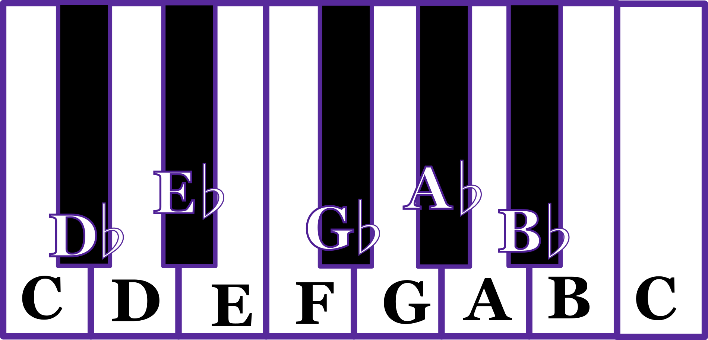

## Capítulo 1
# Notas e Intervalos Musicais

### As 12 notas musicais
Este é o círculo de quintas:

___

É a forma mais informativa de se olhar para as notas musicais. Na nossa infância nós aprendemos as notas musicais *Dó, Ré, Mi, Fá, Sol, Lá, Si* porém adotamos uma notação um pouco diferente ao se falar sobre música. Cada uma dessas notas recebe esse novo nome quando escrevemos sobre música ou escrevemos cifras:

- C é o Dó
- D é o Ré
- E é o Mi
- F é o Fá
- G é o Sol
- A é o Lá
- B é o Si

Em inglés, os músicos chamam as notas por essas letras, mas em português costumamos continuar chamando pelos nomes *Dó, Ré, Mi, etc*. Então quando, por exemplo, você vê *"Esta é uma cadência plagal de F maior para C maior"*, você poderá ler como *"Está é uma cadência plagal e fá maior para dó maior"*. É um pouco estranho no começo, mas logo nos acostumamos.

Repare que no círculo de quitnas, existem mais 5 notas musicais, são o A, D, G, C, F, porém com um símbolo "#" a direita. Este símbolo lê-se *sustenido* e significa que esta nota está um semitom acima. A imagem a seguir mostra como as notas estão distribuidas no teclado musical.

Há também o símbolo ♭ (bemol) para denotar que a nota está a um semitom abaixo:

Portanto o C# e o D♭ são a mesma nota. Ambas as notas bemois e sustenidas são chamadas de "acidentes". É um termo que não faz muito sentido semanticamente, porém ele continua sendo utilizado por tradição. Existe um motivo para usarmos ambas as nomeclaturas de sustenido e bemois. Isso ficará claro em capítulos posteriores.

Reserve um tempo para reparar nas diferenças entre a organização das notas no teclado e a organização das notas no círculo de quintas. Perceba que existe uma ordenação diferente no círculo. As notas no teclado e em muitos isntrumentos como o violão, o violino, dentre outros, as notas são ordenadas de maneira crescente. É uma ordenação muito importante por causa da sonoridade das notas. Porém, a ordenação por quintas possui um outro tipo de importância. É uma ordenação por *consonância*. Notas mais próximas no círculo de quintas são mais consonantes entre si. Notas mais distantes são mais dissonantes entre si.

Esse jogo entre consonância e dissonância é um tema central no estudo da harmonia e vamos continuar falando sobre isso ao longo do livro inteiro, portanto não precisamos tentar definí-los agora. Por enquanto basta saber que o C e o G são bastante consonantes apesar de estarem distantes no teclado e que C e C# são bastante dissonantes apesar de estarem vizinhos no teclado. Isso significa que ao tocar as notas C e C# ao mesmo tempo, você irá sentir que essas notas não "combinam" (com certeza você terá sua própria forma de definir a sensação do confronto entre essas duas notas, você tem liberdade de tentar interpretar por conta própria o que essa sensação significa). 

### Os 12 intervalos musicais

Uma nota sozinha dificilmente terá um "sabor" por conta própria. A maioria das pessoas não possuem ouvido absoluto para conseguir discernir que nota está sendo tocada apenas ouvindo, mesmo assim a grande maioria das pessoas conseguem discernir significados musicais apenas ouvindo, mesmo que não consigam colocar em palavras, as cores e sabores simplesmente surgem no interior da mente do ouvinte. Isso acontece pois essas cores e sabores surgem da *relação* entre diferentes notas musicais. Como dito anteriormente, essas relações podem ser consonantes ou dissonantes e o círculo de quintas é um ótimo indicador de que relação é essa.

Escolha duas notas distintas e as toque simultaneamente. Tente identificar a sensação que surge dentro de você ao ouvir o *confronto* entre essas duas notas. Qual é o sabor desse confronto quando as notas estão próximas no círculo de quinta? e quando estão distantes? Perceba também que não são diferenças lineares, cada uma é diferente e tem sua própria característica. É assim que músicos com ouvido relativo (diferente do ouvido absoluto) conseguem identificar **intervalos musicais**.

Para cado tipo de relação entre notas, existe um termo que identifica o intervalo entre essas notas. O próprio nome do círculo de quintas deriva de um desses termos: a quinta. Assim como existem 12 notas musicais, também existe 12 intervalos musicais (em parenteses nomes alternativos para os mesmos intervalos):

- segunda menor (nona menor)
- segunda maior (nona)
- terça menor
- terça maior
- quarta perfeita (quarta justa)
- quarta aumentada / quinta diminuta
- quinta perfeita
- sexta menor (quinta aumentada)
- sexta maior
- sétima menor
- sétima maior
- oitava

Essa lista, nesta ordem, apresenta o intervalo entre as notas ordenadas de forma crescente (da forma que vemos no teclado musical). 

Vejamos uma versão extendida do teclado musical.

As notas C e C# são vizinhas no teclado e o intervalo entre elas é o de segunda menor. Dizemos que o C# é a segunda menor do C. Outros exemplos de segunda menor inclui o F em relação ao E, o C em relação ao B, o A em relação ao G# e assim por diante. Já o D é a segunda maior de C, enquanto o E é a terça maior de C. O G é a quinta perfeita de C e por isso estão vizinhos no círculo de quintas. No círculo de quintas, todas as notas são quinta perfeitas da nota que está vizinha no sentido anti-horário. Portanto, seguir o círculo de quintas no sentido horário é o mesmo que pular as notas subindo de quinta perfeita em quinta perfeita.

No começo será um pouco chato memorizar todos esses intervalos, mas não é necessário tê-los memorizado logo de cara. Muitos padrões vão surgir conforme formos avançando nos estudos e ficará mais simples de entender os intervalos.

Um desses padrões é o de "temperatura". É difícil fazer analogias com coisas de fora do mundo da música, mas essa é a mais útil por enquanto. Se você olhar para o círculo de quintas e pensar em cada nota de acordo com o seu intervalo em relação ao C, irá perceber que quase as notas a direita do C são todos intervalos com "maior" no nome e as notas do lado esquerdo possuem "menor" no nome:

É importante entender que essas relações são independente da identidade das notas musicais. Pense no círculo de quintas como uma roda que você pode girar. As relações irão continuar as mesmas quando você colocar outra notal no topo do círculo, porém relacionadas a esta nota do topo:

Mas para que serve essa diferenciação entre intervalos "frios" e intervalos "quentes"? Essas são formas subjetivas de se pensar nos intervalos. Cada pessoa pode ter formas diferentes de sentir a diferença entre eles, mas em geral os intervalos menores, do lado esquerdo do círculo de quintas, soam mais tristes ou frios, são ideais para criar sensações mais obscuras. Os intervalos mais quentes, possuem uma sonoridade mais "alegre" ou mais "brilhante", mas podemos passar anos discutindo o que essas sensações realmente significam. O intervalo de sétima maior não é exatamente alegre ou brilhante. No meu ouvido ele soa um tanto quanto melancólico ou dolorido, porém doce, como alguém que tem um amor não correspondido. O inverso da sétima maior é a segunda menor e para mim ele soa negativo de outra forma, como alguém que sente um desgosto ou um certo desdenho, algo áspero ou cortante.

Entretanto, nenhuma forma de descrever esses sentimentos será. Não só muda de pessoa pra pessoa, mas também muda em diferentes contextos. Músicas utilizam instrumentos musicais diferentes, cada instrumento traz consigo propriedades sonoras que também afetam a forma como essas sensações são transmitidas. Combinar esses intervalos em uma guitarra elétrica com certeza soa bem diferente do que combinar esses intervalos usando vozes suaves ou instrumentos doces como um clarinete. Além disso, linguagens harmônicas podem modificar drasticamente essas sensações. No livro de harmonia de Vicent Persichetti ele descreve que que o intervalo de quarta aumentada soa dissonante em contextos diatônicos e soa consonante em contextos cromáticos ou atonais. 