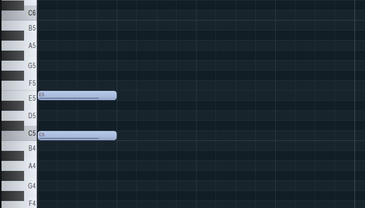
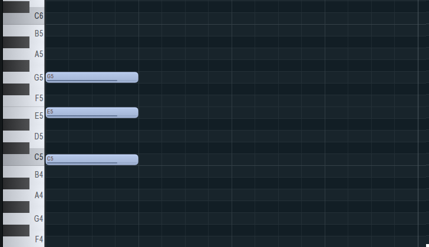
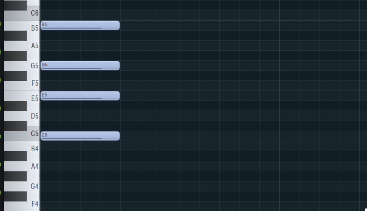
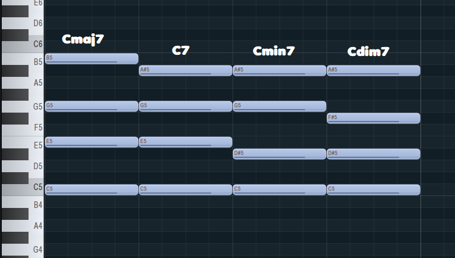
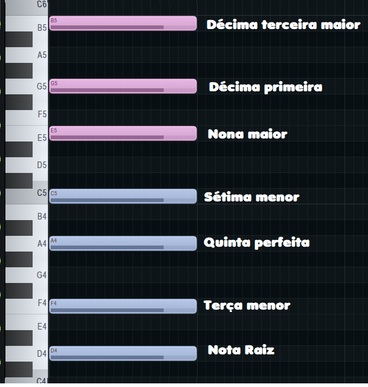
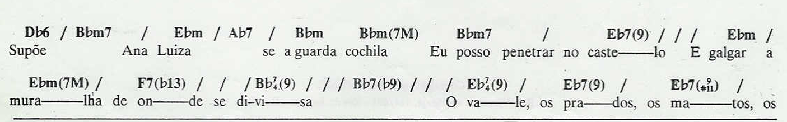

## Capítulo 3

# Acordes

### Acordes Ternários

> Antes de continuar, acredito que seja necessário diferenciar dois tipos principais de análises para evitar algumas confusões futuras. Quando falamos em "conjunto de notas" ou "seleção de notas", estamos fazendo uma análise abstrata. A nota C é uma classe, ela não possui localidade, ela ainda não é um som, ela não existe no mundo real, ela é apenas uma ideia. A partir do momento que tocamos ela em um instrumento (ou pelo menos quando consideramos ela em alguma posição do teclado ou na partitura) ela se torna "real", ela possui uma frequência sonora, ela se torna concreta e partimos para uma análise concreta. Por via de regra, sempre que você ver um diagrama como o círculo de quintas ou um grafo (veremos isso futuramente) estamos em uma análise abstrata. Quando você ver a figura de um teclado musical ou do piano-roll, estamos em uma análise concreta.

Acordes ternários são seleções ordenadas de notas de uma escala onde cada nova nota está a um intervalo de terça (maior ou menor) da nota anterior.

Vamos construir um acorde usando a escala de C maior.

Começamos por escolher a primeira nota, no caso o próprio C. Adicionamos então a terça do C na escala. Como você deve lembrar do capítulo anterior, a terça é o E e é uma terça maior:

Agora vamos adicionar uma nova nota. Ela deve ser a terça (maior ou menor) da nota anterior que é o E. Na escala de C maior a terça do E é o G e é uma terça menor:

Sempre que o acorde ternário possuir 3 notas formadas por terças seguidas, chamaremos ele de *tríade*.

Podemos ir um passo além e adicionar uma quarta nota. Dessa vez a terça do G e obtemos:

Quando o acorde possui 4 notas formadas por terças consectivas, chamaremos de *tétrade*.

Agora você deve perceber que todo acorde ternário é formado por notas da escala seguindo um padrão de alternância. Se você atribuir o número 1 para a primeira nota, então o acorde será formado pelos números impáres: 1, 3, 5, 7, 9 e assim por diante.

Esses números indicarão os nomes dos intervalos presentes. No caso do acorde anterior ele é um C que possui uma terça maior, uma quinta perfeita e uma sétima maior.

É muito comum você encontrar uma notação de acordes chamada *Cifra* onde o acorde é identificado por um termo específico que codifica os intervalos presentes. É como uma abreviação do acorde. No caso do acorde anteior a cifra dele é simplesmente Cmaj7. O "maj" está se referindo a qualidade do intervalo de sétima, que no caso é uma sétima maior. A terça maior e a quinta perfeita são omitidas da Cifra, esses intervalos só aparecem quando há alguma alteração como a terça menor e a quinta diminuta:

Aqui temos alguns exemplos de cifragem com variações nos intervalos do acorde formado sobre o C. Quando a sétima for uma sétima menor, ela é cifrada apenas com um 7. Quando a terça do C for uma terça menor, é adicionado apenas o termo "min" depois do C. Quando a quinta do C for uma uma quinta diminuta, é adicionado apenas um "dim" depois do C e o "min" referente a terça menor é omitido.

Existem inconsistências na linguagem da cifra. Por exemplo, o "maj7" é entendido como "major 7" que se refere a sétima maior. Porém ao ver "min7" é necessário entender que o "min" (minor) se refere a terça menor e não a sétima, apesar de que nesse caso a sétima também é uma sétima menor. Existe o acorde que possui terça menor e sétima maior e ele possui a seguinte cifra: Cminmaj7.

Por isso que existem algumas variações na forma de cifrar os acordes. Por exemplo, o Cmaj7 pode ser cifrado como C7M, onde o "7M" significa sétima maior. O Cmin7 pode ser cifrado simplesmente com um Cm7. Nem sempre vai ser simples de entender o que uma cifra realmente significa, porém a maior parte das confusões podem ser resolvidas com o contexto harmônico que será o tema do próximo capítulo.

### Extensões em Acordes Ternários

Como dito anteriormente os acordes ternários são formados pelos intervalos de números ímpares. O intervalo de oitava é uma repetição da nota raiz que é indicada pelo número 1 (muitas vezes chamado de unissóno). Portanto quando temos um acorde ternário com 5 notas, os intervalos seguem os números ímpares e após a oitava, os intervalos ímpares são repetições dos intervalos pares, o que significa que:

- A **Nona** é uma repetição da **Segunda**
- A **Décima Primeira** é uma repetição da **Quarda**
- A **Décima Terceira** é uma repetição da **Sexta**

Assim, os intervalos que pulamos ao criar acordes ternários irão aparecer após a oitava e eles são chamados de extensões.

Vejamos o exemplo do acorde ternário sob o D como raiz contendo todas as extensões possíveis dentro da escala do C maior:

A cifra desse acorde, como já vimos, omite a quinta e apresenta as extensões, porém é uma prática omitir também as extensões internas (e a sétima) e apresentar somente a última extensão presente: **Dmin13**. Como pode ver, omitimos também a qualidade de "maior" da décima terceira. Também omitiriamos a qualidade de "maior" da nona caso ela aparecesse na cifra. Para cada intervalo existe um padrão que é omitido na cifra e apenas a alteração é apresentada.

Agora é uma boa hora de rever todos os intervalos considerando quais são considerados padrões na cifra e que são geralmente omitidos. Na seguinte lista, os intervalos cujo os números aparecem na cifra terão um **@** à frente e os intervalos cuja qualidade *não* são omitidas na cifra terão um **$** à frente:

- Unissóno
- Segunda menor @$
- Segunda maior @
- Terça menor $
- Terça maior
- Quarta justa @
- Quarta aumentada @$
- Quinta diminuta $
- Quinta perfeita
- Sexta menor @$
- Sexta maior @
- Sétima menor @
- Sétima maior @$
- Oitava
- Nona menor @$
- Nona maior @
- Décima primeira justa @
- Décima primeira aumentada @$
- Décima terceira menor @$
- Décima terceira maior @

Essa regra não é universal. Existem exceções e práticas diferentes. Cifras de Jazz feitas nos Estados Unidades são diferentes das Cifras de MPB e Bossa Nova feitas no Brasil. Portanto, como já dito anteriormente, a melhor forma de ter certeza do significado de uma cifra é através do contexto harmônico e também do conhecimento da música que está sendo cifrada. 

Na cifra de Ana Luiza, música de Tom Jobim, cifrada por Almir Chediak, temos alguns acordes usando o símbolo **♭** (bemol) que representa a nota raiz, porém os intervalos de Nona menor e Décima primeira menor são representados com um ♭ prefixando o número do intervalo. Para evitar confusão, Almir Chediak usa o parêntese para separar os intervalos. Outra diferença em relação ao que apresentei nesse capítulo é que ele não omite as extensões internas.

