## Capítulo 3

# Acordes

### Acordes Ternários

> Antes de continuar, acredito que seja necessário diferenciar dois tipos principais de análises para evitar algumas confusões futuras. Quando falamos em "conjunto de notas" ou "seleção de notas", estamos fazendo uma análise abstrata. A nota C é uma classe, ela não possui localidade, ela ainda não é um som, ela não existe no mundo real, ela é apenas uma ideia. A partir do momento que tocamos ela em um instrumento (ou pelo menos quando consideramos ela em alguma posição do teclado ou na partitura) ela se torna "real", ela possui uma frequência sonora, ela se torna concreta e partimos para uma análise concreta. Por via de regra, sempre que você ver um diagrama como o círculo de quintas ou um grafo (veremos isso futuramente) estamos em uma análise abstrata. Quando você ver a figura de um teclado musical ou do piano-roll, estamos em uma análise concreta.

Acordes ternários são seleções ordenadas de notas de uma escala onde cada nova nota está a um intervalo de terça (maior ou menor) da nota anterior.

Vamos construir um acorde usando a escala de C maior.

Começamos por escolher a primeira nota, no caso o próprio C. Adicionamos então a terça do C na escala. Como você deve lembrar do capítulo anterior, a terça é o E e é uma terça maior:

Agora vamos adicionar uma nova nota. Ela deve ser a terça (maior ou menor) da nota anterior que é o E. Na escala de C maior a terça do E é o G e é uma terça menor:

Sempre que o acorde ternário possuir 3 notas formadas por terças seguidas, chamaremos ele de *tríade*.

Existem 4 tipos de tríades. A tríade maior, vista acima, a tríade menor que possui uma Terça menor e uma Quinta perfeita (que é a Terça maior da Terça menor), a tríade diminuta que possui uma Terça menor e uma Quinta diminuta (que é a Terça menor da Terça menor) e por fim a tríade aumentada que possui uma Terça maior e uma Quinta aumentada (que é uma Terça maior da Terça maior)

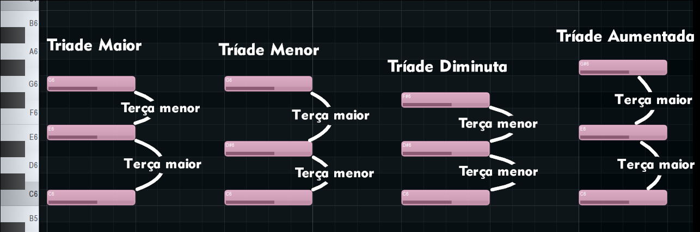

Podemos ir um passo além e adicionar uma quarta nota. Dessa vez a terça do G e obtemos:

Quando o acorde possui 4 notas formadas por terças consectivas, chamaremos de *tétrade*.

Agora você deve perceber que todo acorde ternário é formado por notas da escala seguindo um padrão de alternância. Se você atribuir o número 1 para a primeira nota, então o acorde será formado pelos números impáres: 1, 3, 5, 7, 9 e assim por diante.

Esses números indicarão os nomes dos intervalos presentes. No caso do acorde anterior ele é um C que possui uma terça maior, uma quinta perfeita e uma sétima maior.

É muito comum você encontrar uma notação de acordes chamada *Cifra* onde o acorde é identificado por um termo específico que codifica os intervalos presentes. É como uma abreviação do acorde. No caso do acorde anteior a cifra dele é simplesmente Cmaj7. O "maj" está se referindo a qualidade do intervalo de sétima, que no caso é uma sétima maior. A terça maior e a quinta perfeita são omitidas da Cifra, esses intervalos só aparecem quando há alguma alteração como a terça menor e a quinta diminuta:

Aqui temos alguns exemplos de cifragem com variações nos intervalos do acorde formado sobre o C. Quando a sétima for uma sétima menor, ela é cifrada apenas com um 7. Quando a terça do C for uma terça menor, é adicionado apenas o termo "min" depois do C. Quando a quinta do C for uma uma quinta diminuta, é adicionado apenas um "dim" depois do C e o "min" referente a terça menor é omitido.

Existem inconsistências na linguagem da cifra. Por exemplo, o "maj7" é entendido como "major 7" que se refere a sétima maior. Porém ao ver "min7" é necessário entender que o "min" (minor) se refere a terça menor e não a sétima, apesar de que nesse caso a sétima também é uma sétima menor. Existe o acorde que possui terça menor e sétima maior e ele possui a seguinte cifra: Cminmaj7.

Por isso que existem algumas variações na forma de cifrar os acordes. Por exemplo, o Cmaj7 pode ser cifrado como C7M, onde o "7M" significa sétima maior. O Cmin7 pode ser cifrado simplesmente com um Cm7. Nem sempre vai ser simples de entender o que uma cifra realmente significa, porém a maior parte das confusões podem ser resolvidas com o contexto harmônico que será o tema do próximo capítulo.

### Inversões de Acordes

Acordes ternários não precisam estar sempre na ordem que vimos acima. É possível trocar a ordem das notas. Apesar de mudar a estrutura do acorde, a formação continua sendo a mesma. Um acorde formado por terças empilhadas continua sendo um acorde ternário mesmo se a ordem das notas estiver trocada. As inversões de acorde serão essenciais para construção de progressões harmônicas e também para condução de vozes, temas que veremos profundamente nos capítulos 5, 6 e 9.

Existem 3 inversões de acordes e elas são feitas sobre tríades ou tétrades. Acordes que possuem extensões (que veremos no próximo tópico) também podem ter inversões.

Considere o acorde de Cmaj7 como mostrado na figura 3.4, chamamos ele de *posição de raiz*, pois a nota mais grave, o baixo, é a própria raiz do acorde. Chamamos de *primeira inversão* o acorde obtido ao se elevar o C uma oitava acima, agora a nota de baixo é o E:

A *segunda inversão* é obtida ao se elevar o E da primeira inversão uma oitava acima, assim como foi feito com o C. Agora o baixo é o G:

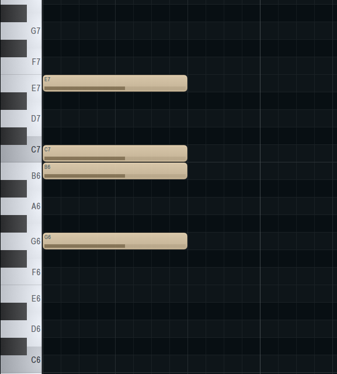

Por fim, a *terceira inversão* é obtida ao se elevar o G uma oitava acima, agora o B se torna o baixo do acorde:

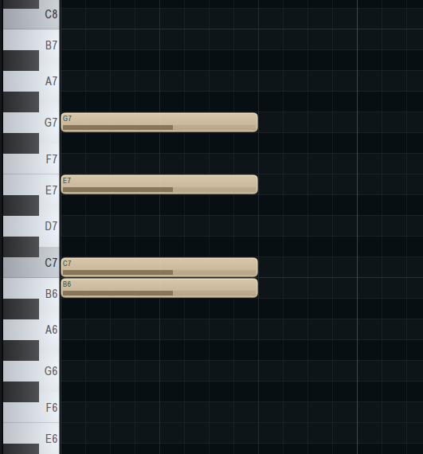

A única coisa que importa para se definir a inversão é a nota de baixo. Se a nota de baixo for a Terça da raiz, então se trata da primeira inversão. Se a nota de baixo for a Quinta da raiz, então é a segunda inversão e se a nota de baixo for a Sétima da raiz, então temos a terceira inversão. Isso só fará sentido se a própria raiz do acorde não estiver sendo omitido, mas outro intervelo do acorde pode ser omitido, contanto que não seja o baixo. Por exemplo, podemos ter um Cmaj7 em primeira inversão com a Quinta (neste caso o G) omitido:

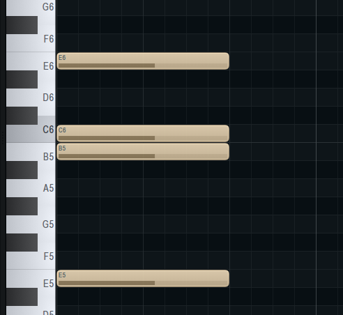

Inversões também possuem algumas formas de serem expressos em Cifra. A que eu irei adotar usa uma barra após a cifra original, por exemplo, a cifra da primeira inversão do acorde de C com Sétima maior é **Cmaj7/E**.

Essa forma de cifragem não é usada apenas para as inverões, mas também para trocas de baixo.

### Extensões em Acordes Ternários

Como dito anteriormente os acordes ternários são formados pelos intervalos de números ímpares. O intervalo de oitava é uma repetição da nota raiz que é indicada pelo número 1 (muitas vezes chamado de unissóno). Portanto quando temos um acorde ternário com 5 notas, os intervalos seguem os números ímpares e após a oitava, os intervalos ímpares são repetições dos intervalos pares, o que significa que:

- A **Nona** é uma repetição da **Segunda**
- A **Décima Primeira** é uma repetição da **Quarda**
- A **Décima Terceira** é uma repetição da **Sexta**

Assim, os intervalos que pulamos ao criar acordes ternários irão aparecer após a oitava e eles são chamados de extensões.

Vejamos o exemplo do acorde ternário sob o D como raiz contendo todas as extensões possíveis dentro da escala do C maior:

A cifra desse acorde, como já vimos, omite a quinta e apresenta as extensões, porém é uma prática omitir também as extensões internas (e a sétima) e apresentar somente a última extensão presente: **Dmin13**. Como pode ver, omitimos também a qualidade de "maior" da décima terceira. Também omitiriamos a qualidade de "maior" da nona caso ela aparecesse na cifra. Para cada intervalo existe um padrão que é omitido na cifra e apenas a alteração é apresentada.

Agora é uma boa hora de rever todos os intervalos considerando quais são considerados padrões na cifra e que são geralmente omitidos. Na seguinte lista, os intervalos cujo os números aparecem na cifra terão um **@** à frente e os intervalos cuja qualidade *não* são omitidas na cifra terão um **$** à frente:

- Unissóno
- Segunda menor @$
- Segunda maior @
- Terça menor $
- Terça maior
- Quarta justa @
- Quarta aumentada @$
- Quinta diminuta $
- Quinta perfeita
- Sexta menor @$
- Sexta maior @
- Sétima menor @
- Sétima maior @$
- Oitava
- Nona menor @$
- Nona maior @
- Décima primeira justa @
- Décima primeira aumentada @$
- Décima terceira menor @$
- Décima terceira maior @

Essa regra não é universal. Existem exceções e práticas diferentes. Cifras de Jazz feitas nos Estados Unidades são diferentes das Cifras de MPB e Bossa Nova feitas no Brasil. Portanto, como já dito anteriormente, a melhor forma de ter certeza do significado de uma cifra é através do contexto harmônico e também do conhecimento da música que está sendo cifrada. 

Na cifra de Ana Luiza, música de Tom Jobim, cifrada por Almir Chediak, temos alguns acordes usando o símbolo **♭** (bemol) que representa a nota raiz, porém os intervalos de Nona menor e Décima primeira menor são representados com um ♭ prefixando o número do intervalo. Para evitar confusão, Almir Chediak usa o parêntese para separar os intervalos. Outra diferença em relação ao que apresentei nesse capítulo é que ele não omite as extensões internas.

### Intervalos Suspenos e Resoluções

Vimos no capítulo 1, ao analisar os significados dos intervalos, que alguns deles quase que "pedem" para serem resolvidos ou para se mover para cima ou para baixo. Quando um intervalo consonante faz parte de um acorde, geralmente existe alguma nota vizinha (na ordem do teclado) que pode ser uma dissonância e pedir para ser resolvido no intervalo consonante próximo a ele. Vejamos alguns exemplos simples.

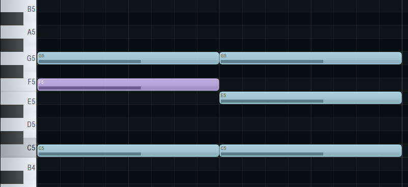

Neste exemplo vemos um acorde de C com quarta suspensa. O intervalo de quarta justa, que no caso é um F, se encontra em um contexto considerado dissonante. Apesar de não definir-mos a Quarta como um intervalo dissonante, no contexto de um acorde maior em uma escala diatônica, ele geralmente soa como se fosse dissonante, provavelmente porque nosso ouvido musical já busca a Terça maior ao ouvir o acorde e a Quarta forma um intervalo de segunda menor (altamente dissonante) com essa Terça maior imaginária. Assim, o F implora para ser resolvido para a terça, descendo um semitom. 

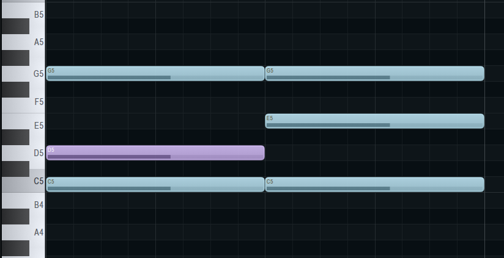

Este outro exemplo é muito semelhante, porém usando a Segunda suspensa ao invés da Quarta. Neste caso a tensão é menor pois a Segunda forma um intervalo de Sétima maior com a Terça maior imaginária.

> Essa ideia de intervalo imaginário é uma forma simplificada de pensar em alguns conceitos vistos em alguns livros bem avançados sobre harmonia, como o Experiência Harmônica de W. A. Mathieu e Writings on Music Theory de James Tenney. Eu resolvi falar sobre isso de forma simplificada e passageira para tentar atiçar a mente do leitor a tentar pensar de forma mais subjetiva nas sensações musicais causadas pelos complexos sonoros. 

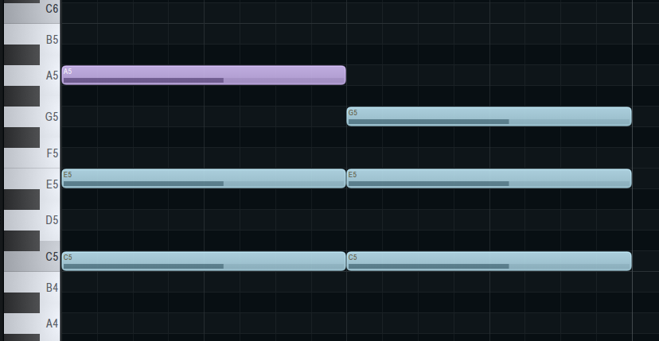

Neste outro exemplo temos uma consonância em A (Sexta maior) que pede para se mover um tom abaixo para a Quinta perfeita.

Esses 3 exemplos também funcionam para acordes de Terça menor em escalas diatônicas, mas para acordes menores temos ainda mais alguns exemplos possívei:

A Sexta menor é uma forte dissonância, mas fica ainda mais forte nesse contexto pois forma uma Nona menor com a Quinta imaginária. No caso da Sexta maior, ela se torna uma dissonância mais forte em um acorde menor por formar uma Quarta aumentada com a Terça menor, ela pode descer para a Quinta perfeita, mas um movimento ainda mais satisfatório é o de subir para a Sétima menor e por fim a Nona menor em um acorde menor é uma forte dissonância e pode ser resolvida descendo um semitom para a oitava.

Naturalmente podemos usar mais de uma suspensão ao mesmo tempo e movimentar ambas as notas, uma de cada vez ou ao mesmo tempo:

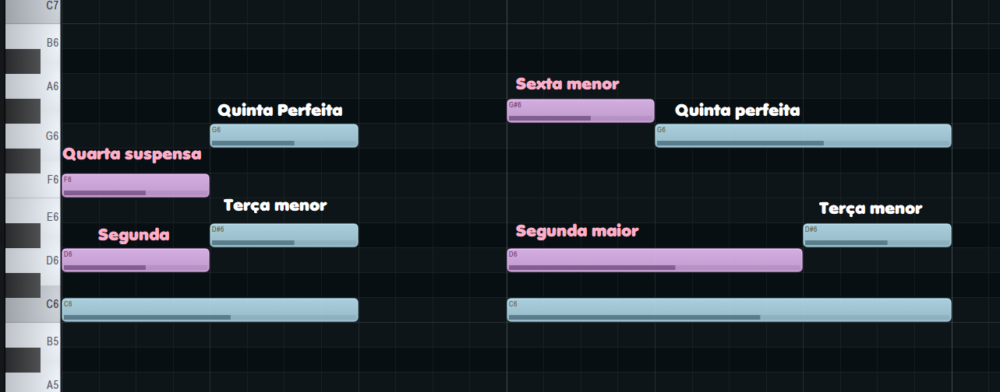

Essas ideias de movimento de notas específicas será explorado com maior profundidade no capítulo 9, mas já podemos ir percebendo algumas coisas importantes. Em primeiro lugar, esses movimentos são sempre pequenos, pode ser de um semitom ou um tom, mas de preferência é um movimento de um semitom. Alguns acordes novos são descobertos justamente por causa dessa preferência. Por exemplo, numa tonalidade em que o F possui terça maior, se ele possuir uma Segunda suspensa ou uma Nona maior, ela poderá, ao invés de subir um tom para a Terça maior, subir apenas um semitom e se tornar uma Terça menor, formando assim um acorde de F menor em um contexto onde ele deveria ser maior, o que nos traz uma variedade harmônica.

### Intervalo sustentado

Em muitos casos, o intervalo suspenso, ou mesmo uma extensão, surge por causa de uma nota do acorde anteior que se sustenta até o próximo acorde, isso cria uma satisfação ainda maior de resolução ou movimento. Vejamos um exemplo:

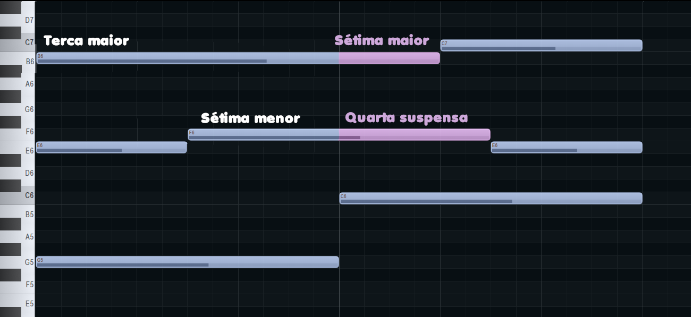

Neste exemplo temos um acorde de G7 que, obviamente, possui uma Sétima menor e uma Terça maior, respectivamente, o F e o B. Nenhuma dessas duas notas está presente no acorde do C maior, que é o próximo acorde nessa progressão. Tanto o F como o B são então sustentados enquanto o acorde de C maior começa a ser executa. O F que antes era a Sétima menor de G, agora se transforma na Quarta de C e o B que era a Terça maior de G agora se torna a Sétima maior de C, essas notas funcionam como intervalos suspensos e então relaxam, respectivamente, para o E (a Terça maior de C) e o próprio C uma oitava acima.

Intervalos sustentatos são essenciais para se criar harmônias dinâmicas e profundas. Muitas vezes, inclusive, esse tipo de intervalo é justamente o que justifica escolhas harmônicas. Você pode colocar um G sobre um acorde de F sob a justificativa de que a Nona maior é um lindo intervalo, mas você pode ter uma justificativa maior ainda se o acorde anterior possuir um G como consonância que pode então ser um intervalo sustentado.

Tom Jobim em sua famosa música [Samba de uma nota Só](https://www.youtube.com/watch?v=YacrKDzDJo4) faz uso dessa técnica de forma mais extensa, mantendo um D fixo através de muitos acordes inclusive mudando de tonalidade. É um exemplo espetacular que vale a pena ser analisado.

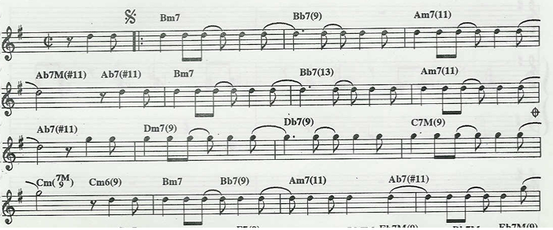

### Acordes Sobrepostos

A ideia de se sustentar notas de um acorde na duração de outro acorde nos transporta a ideia já discutida de acordes sobrepostos. Se acordes ternários são construídos a partir de Terças empilhadas, então é natural que dois acordes ternários podem ser empilhados e isso gera exatamente o que chamamos de Extensões, que já vimos nesse capítulo. Se você empilhar um G maior após um A menor, as notas da tríade do G maior formaram a Sétima menor, a Nona maior e a Décima primeira do A e nesse caso ele se torna apenas um A menor com extensões. Porém, o que acontece se escolhermos um outro acorde que não forme as extenções de A? Por exemplo, um um D maior sobre um A maior, irá criar um acorde que possui a Quarta perfeita e a Sexta maior, mas não serão considerados suspensões pois a Terça menor e a Quinta já estão presentes, portanto não existe espaço para esses intervalos se moverem.

A maioria dos acordes sobrepostos que são interessantes são também os mais dissonantes, pois não há muita liberdade harmônica dentro de uma escala de 7 notas. O uso de acordes sobrepostos ajuda na criação de sonoridades que vão além da escala diatônica. Um pouco dessa idea foi visto no capítulo anterior, mas iremos visualizar mais exemplos nesta seção por dois motivos, o primeiro é ajudar o leitor a se acostumar com complexos harmônicos mais dissonantes, o segundo é preparar para os capítulos seguintes onde haverá uma maior complexidade para estudarmos e teremos que fazer referência a esse tipo de acorde. O acorde de Petrushka visto no capítulo anterior, se torna uma ferramenta muito poderosa para se extender a tonalidade, mas além disso também usaremos o acorde diminuto e o acorde aumentado sobrepondo sobre outros acordes.

Vejamos alguns exemplos:

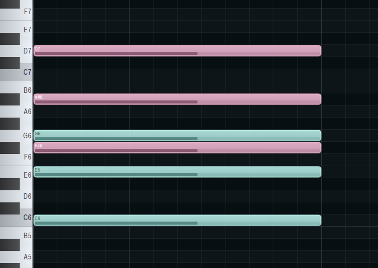

Aqui temos uma versão alterada do acorde de Petrushka. Se trata de um F# aumentado sobreposto a um C maior. As notas do acorde F# aumentado definem sobre o acorde de C os intervalos de Quarta aumentada, Sétima menor e Nona maior. Se elevarmos o F# uma oitava acima, obteremos uma estrutura de acorde mais brilhante, mas ainda com a mesma função.

