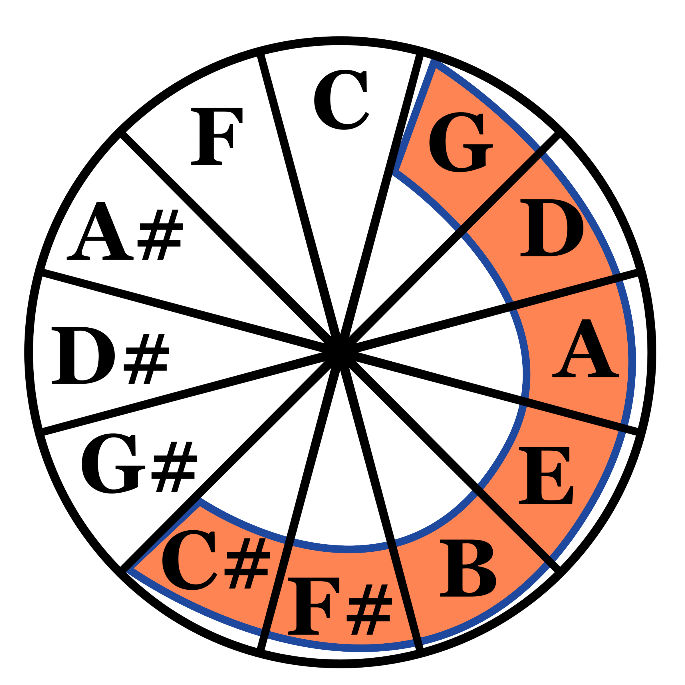

## Capítulo 4

# Campo Harmônico

### Tríades do Campo Harmônico

Estudar o Campo Harmônico é basicamente juntar o que aprendemos no capítulo 2 e no capítulo 3 e adicionar algumas nomeclaturas a mais. 

Vamos usar a escala de D maior como exemplo. Relembrando:

E agora vamos formar todas as possíveis tríades, como visto no capítulo 3:

É possível perceber que temos 3 acordes maiores, 3 acordes menores e 1 acorde diminuto (que possui terça menor e quinta diminuta). O instervalos mudam de acorde para acorde porque, claramente, a escala não é simétrica (estudaremos escalas simétricas no capítulo 13).

O Campo Harmônico do D maior é justamente todo conjunto de acordes que é possível formar dentro da escala de D maior. Chamamos o Campo Harmônico de D maior de **Tonalidade** de D maior. É bastante comum haver confusão entre os termos Tonalidade e Escala. A Escala de D maior é apenas o conjunto de 7 notas que formam uma vizinhaça no círculo de quintas e que vai do G ao C#. A Tonalidade de D maior é um conjunto de acordes e cada um deles possui uma *função* perante a tonalidade. O conjunto de notas é o mesmo, porém a forma de pensar nelas e a forma de usar é diferente.

Por exemplo, o G é apenas uma nota na escala de D maior, é a quarta nota se você olhar para a ordem no teclado e é a primeira nota se você olhar para a ordem no círculo de quintas. Entretanto na Tonalidade de D maior, o G é um acorde maior, é o quarto acorde, é também chamado de IV grau (quarto grau) e essa será uma nomeclatura importante, pois toda tonalidade possui um IV grau e também um II grau, III grau, V grau, VI grau, VII grau e I grau. O IV grau da Tonalidade de D maior é o acorde de G maior, enquanto que o IV grau da Tonalidade de C maior é o acorde de F maior. São dois acordes diferentes, com notas diferentes, porém possuem funções análogas em suas respectivas tonalidades.

### Tétrades do Campo Harmônico

Vamos agora adicionar mais uma terça nos acordes anteriores para formar tétrades:

Antes tinhamos apenas 3 tipos diferentes de acordes, os maiores, os menores e os diminutos, mas ao adicionar a sétima em cada um deles, agora podemos dividir em 4 tipos de acodes, acordes maiores com sétima maior, acordes menores com sétima menor, acordes maiores com sétima menor e um acorde diminuto com sétima. Se continuarmos nesse raciocínio, ao adicionar a Nona em cada acorde teríamos 5 tipos diferentes de acordes. A cada novo intervalo, alguma nova diferença vai surgir, de modo que quando tivermos acordes de 7 notas (diferentes), cada acorde possuirá uma formação única. Isso será visto com mais profundidade no capítulo 7, mas por enquanto é útil saber deste fato poís isso implica que cada acorde da tonalidade possui a própria função e ela é única dentro da tonalidade, essa função irá ser identificada (por enquanto) pelo nomeclatura de graus: I grau, II grau, III grau e assim por diante.

Neste caso o I grau da tonalidade de D maior é o Dmaj7, que pode possuir extensões como a Nona, a Décima primeira e a Décima terceira. O IV grau é o Gmaj7 que também poderá possuir as mesmas extensões do I grau, porém a Décima primeira será aumentada, pois se trata de um C#. Sempre haverá alguma diferença entre um acorde e outro do campo harmônico.

Sabendo que cada campo harmônico possui 7 acordes diferentes e que existem 12 campo harmônicos diferentes, isso significaria que temos 84 acordes diferentes. Entretanto, como veremos em breve, esse número na verdade é muito maior, pois existem também tonalidades menores que possuem alterações nos acordes.

### Campo Harmônico Menor

O campo harmônico menor funciona da mesma forma do campo harmônico maior, porém partimos do VI grau ao invés do I grau. Assim, a ordenação se modifica. Chamamos o VI grau de I grau, o VII de II, o I de III, o II de IV e assim por diante. Além disso, existem duas variações importantes que precisamos considerar.

### Regiões do Campo Harmônico

